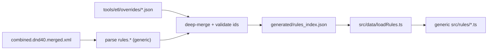

# Data overlay (declarative behavior)

The character builder is **data-driven**: behavior for any specific race, class,
power, theme, paragon path, or epic destiny is authored as data, not as
entity-specific branches in code. Most behavior is parsed directly from the
compendium (`combined.dnd40.merged.xml`). Where the compendium is incomplete or
ambiguous, the gap is filled by a **declarative overlay** instead of hardcoding
ids/names in Python (`tools/etl/build_rules_index.py`) or TypeScript
(`src/rules/*.ts`).

## Where it lives

`tools/etl/overrides/*.json` — every file is loaded and deep-merged (filename
order) by `tools/etl/overlay.py` during the ETL, then applied to the parsed
index just before `generated/rules_index.json` is written.



## File shape

```jsonc
{
  // Per-entity overrides: deep-merged onto the matching index row by id.
  "<collection>": {
    "<entityId>": { /* fields to merge onto the row */ }
  },

  // Cross-entity config tables.
  "global": {
    "<key>": <value>
  }
}
```

`<collection>` must be one of the top-level `rules_index.json` arrays
(`races`, `classes`, `feats`, `powers`, `racialTraits`, `classFeatures`,
`themes`, `paragonPaths`, `epicDestinies`, `hybridClasses`, ...). See
`ENTITY_COLLECTIONS` in `tools/etl/overlay.py` for the full list. Any other
top-level key (besides `global`) raises a build error.

## Merge semantics

- Dicts are merged recursively.
- Lists and scalars replace.
- Per-entity overrides are matched by the row's `id` (the compendium
  `internal_id`). Unknown ids are reported to `generated/etl_anomalies.jsonl`
  as `{"kind": "overlay_unknown_id", ...}` (the build does not fail).

## Global config keys

Authored in `tools/etl/overrides/global.json`; consumed in
`build_rules_index.py` and surfaced on the index for the runtime.

| Key | Type | Purpose |
|-----|------|---------|
| `archerWarlordClassFeatureId` | string | Archer Warlord feature id for mechanical effects |
| `paragonPowerPointsClassFeatureId` | string | Paragon Power Points feature id detection |
| `humanPowerSelectionTraitId` / `bonusAtWillTraitId` / `heroicEffortTraitId` | string | Human power bundle trait ids |
| `psionicPowerPointsByLevel` | object | PHB3 augmentation PP by level (→ `index.psionicPowerPointsByLevel`) |
| `hybridPsionicAugmentationBreakpoints` | number[] | Hybrid psionic choice levels |
| `paragonMulticlassNonPsionicToPsionicAtWillPenalty` | number | At-will slot penalty |
| `wizardMageCantripPowerNames` | string[] | Cantrip power names expanded onto cantrip features |
| `mageCantripsFeatureIds` | string[] | Class-feature ids that grant the cantrip set |
| `optionalClassFeatureNamesByClassId` | object | Optional class features not on `_PARSED_CLASS_FEATURE` |
| `hunterScoutAspectL7PowerNames` | string[] | Hunter/Scout Aspect of the Wild supplements |
| `psionicMulticlassSwapByFeat` | object | Psionic multiclass slot-swap directions keyed by feat name |
| `featPowerNameAliases` | object | Compendium typo/shorthand → real power name (→ `index.featPowerNameAliases`) |
| `internalPowerDisplayNames` | object | Display names for internal power ids |
| `ritualCastingFeatureNames` | string[] | Class-feature names that grant ritual mastery (→ feature `grantsRitualCasting`) |
| `ritualCasterFeatNames` | string[] | Feat names that grant ritual mastery (→ feat `grantsRitualCasting`) |
| `classFeatureChoiceGroupSchoolFilters` | object | Progressive school-pick gating keyed by choice-group key (→ group `schoolFilter`) |

## Per-entity behavior fields

Per-entity overrides set the same fields the ETL would otherwise parse from
`rules.*`. Common examples:

```jsonc
{
  "racialTraits": { "ID_FMP_RACIAL_TRAIT_356": { "grantsBonusClassAtWill": true } },
  "classFeatures": {
    "ID_FMP_CLASS_FEATURE_2286": { "mechanicalEffects": [ /* ... */ ] },
    "ID_FMP_CLASS_FEATURE_318": {
      "spellbookKind": "wizard",
      "spellbookPowerPicksPerPool": 2,
      "spellbookRitualMilestones": [ { "level": 1, "pickCount": 3 } /* ... */ ]
    }
  }
}
```

Behavior fields emitted (overlay or ETL-detected) and consumed generically by the
runtime, so `src/rules/*.ts` never branches on ids/names:

| Field | Entity | Meaning |
|-------|--------|---------|
| `spellbookKind` | classFeature, choice group | `"wizard"` / `"mage"` spellbook mechanic |
| `spellbookPowerPicksPerPool`, `spellbookRitualMilestones` | classFeature | Wizard spellbook pick/ritual schedule |
| `schoolFilter` | choice group | Progressive Apprentice→Expert→Master school gating |
| `grantsRitualCasting` | classFeature, feat | Grants ritual mastery (was "Ritual Casting"/"Ritual Caster" name match) |
| `roleProgression` | classFeature | DMG2 role milestone power swap (`{role, kind}`) |
| `abilityBonusSource` | race | `"subrace"` when the race defers its ability bonus (was "See the Race Chosen") |

See `RulesIndex` and the per-entity interfaces in `src/rules/models.ts` for the
field shapes, and `docs/class-build-options.md` for the choice-group /
power-replace / mechanical-effects model.

## Adding a new behavior

1. Prefer parsing it generically from the compendium in
   `build_rules_index.py` if the data is present.
2. Otherwise add an entry to `tools/etl/overrides/global.json` (config) or a
   per-entity collection block (entity field).
3. Run `python tools/etl/build_rules_index.py` and confirm the
   `generated/rules_index.json` diff is intentional.
4. Keep `src/rules/*.ts` generic — read the new index field; do not hardcode
   the id/name. The guard test `tests/rules/noEntitySpecificLiterals.test.ts`
   enforces this.

## Related docs

- `docs/special-cases-refactor-checklist.md` — inventory of migrated cases.
- `docs/class-build-options.md` — class/race build behavior model.
- `tools/etl/FEAT_RULES_COVERAGE.md` — feat rule coverage.
